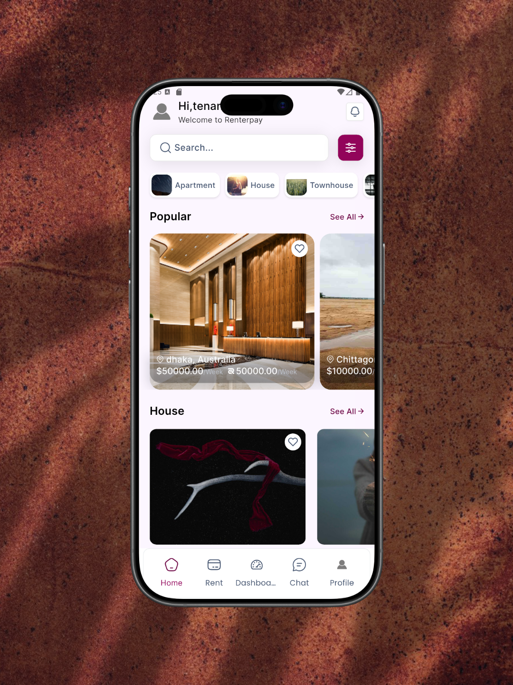

# 🏠 Rent Pay


A cross-platform Flutter application for buying, renting, and managing 
residential and commercial spaces — including apartments, villas, and offices.

---

## 📌 About

Rent Pay is a digital real estate platform that connects property owners, 
agents, and buyers/renters. The app supports four distinct user roles, 
each with its own dedicated UI and functionality.

---

## ✨ Features

- 🌗 Light & Dark mode
- 👥 Four user roles with separate access control
- 🔐 Firebase Authentication with user token management
- 🔍 Search suggestions with Flutter Typeahead
- 📅 Date-based filtering with Table Calendar
- 🗺️ Map integration with Flutter Map
- ✍️ Digital signature support
- ⚙️ CI/CD pipeline via GitHub Actions

---
## 📸 Screenshots
### Oboarding
### User Selection
### Login & Sign Up
### HomePage
### Dashboard


---

## 🏗️ Architecture

This project follows **MVVM (Model-View-ViewModel)** architecture
with **GetX** for state management, dependency injection, and navigation.

```
lib/
├── core/              # Constants, theme, utilities, app colors, GetX navigation & route management
├── modules/           # Feature screens (View + ViewModel)
│   ├── binding/       # manage and bind controller data
│   ├── controller/    # logical and functional part
│   ├── view/          # implement Ui, logical, function code
│   └── widgets/       # shared element for this mod
└── main.dart          # main page of the app
```

---
## 👥 User Roles

| Role | Description |
|------|-------------|
| **Landlord (Owner)** | Can list and manage properties |
| **Agent** | Can manage listings on behalf of owners |
| **Tenanr (Buyer)** | Can browse and purchase properties |
| **Service Vendor** | Give all Service of Property |

---

## 🛠️ Tech Stack

| Category | Technology |
|----------|------------|
| Framework | Flutter & Dart |
| State Management | GetX |
| Authentication | Firebase Auth |
| Local Storage | Get Storage |
| API | REST API |
| Maps | Flutter Map |
| CI/CD | GitHub Actions |

---

## 📦 Packages Used

- `get` — State management, navigation & routing
- `firebase_auth` — Authentication
- `get_storage` — Local data storage
- `image_picker` — Image selection
- `flutter_screenutil` — Responsive UI
- `flutter_typeahead` — Search suggestions
- `flutter_spinkit` — Loading animations
- `flutter_map` — Map integration
- `table_calendar` — Calendar & date filtering
- `flutter_signature` — Digital signatures

---

## 🏗️ Architecture

This project follows **MVVM (Model-View-ViewModel)** architecture 
with **GetX** for state management and dependency injection.
---

## 🚀 Getting Started

### Prerequisites
- Flutter SDK >= 3.0.0
- Dart >= 3.0.0
- Firebase project configured

### Installation

```bash
# Clone the repo
git clone https://github.com/Ariful3111/retn_pay.git

# Navigate to project
cd retn_pay

# Install dependencies
flutter pub get

# Run the app
flutter run
```

---

## ⚙️ CI/CD

This project uses **GitHub Actions** for continuous integration. 
On every push to `main`, the pipeline automatically builds 
and validates the Flutter application.
